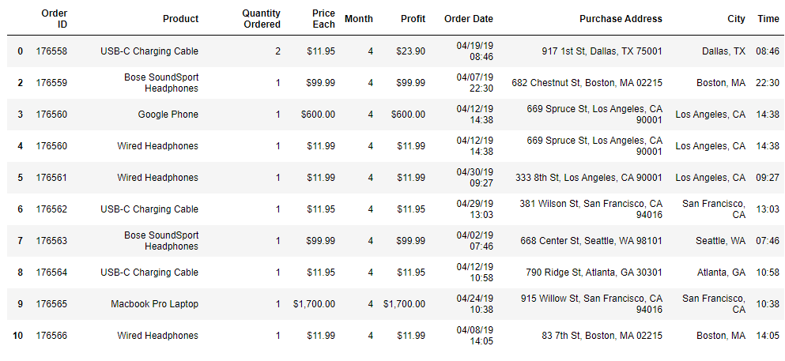
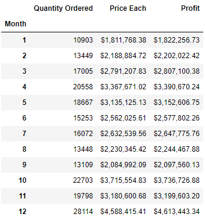
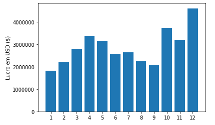
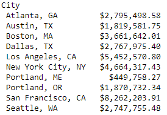
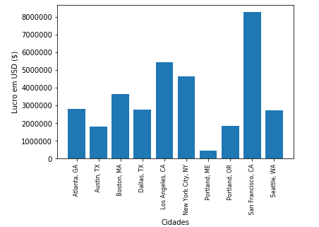
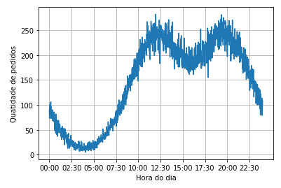

# Vendas

Os dados análisados foram retirados do Kaggle, um site para compartilhamento de dados e são referentes ao território dos EUA.

As vendas estavam definidas por mês no período de 1 ano e para facilitar a análise, os dados foram condensados em um único arquivo "all_data.csv" e após o tratamento dos dados foi  gerada a seguinte tabela.

Com os dados disponíveis, algumas informações puderam ser coletadas, como:

Vendas por mês:

Vendas por cidade:

Vendas por horário:

